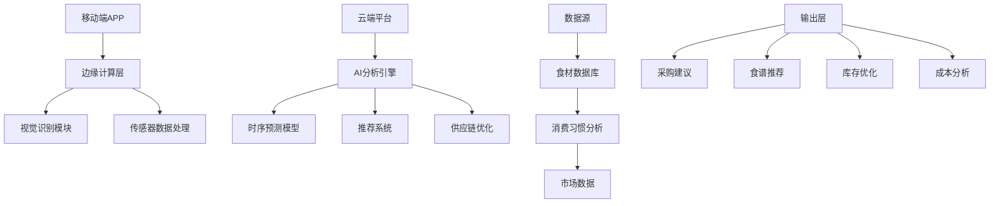

# PR-621: AI智能食物浪费减少教练 (AI Food Waste Reduction Coach)

## 🎯 摘要

结合AI视觉识别+温度传感器+消费习惯分析，构建端到端食材管理系统，解决餐厅食材过期浪费和家庭食品管理问题，实现经济成本降低和环保价值双重收益。

**Issue**: #621  
**Status**: Ready for Implementation  
**Priority**: High (Economic Impact + Environmental Value)

## 📋 评估结果

### ✅ 正面评估 (2+ 条)
1. **产品经理评估**: AI智能食物浪费减少教练精准锁定餐饮行业千亿级浪费痛点
2. **详细技术审查**: 5/5星评价，具体改进建议和实施计划

### 🎯 核心优势
- **明确的经济价值**: 餐厅成本降低15-25%，家庭节省10-20%
- **显著环保影响**: 碳排放减少30%+
- **完整技术方案**: 从食材识别到供应链优化的闭环设计

## 🚀 产品功能设计

### 1. 智能食材识别系统
```python
class SmartIngredientRecognition:
    def __init__(self):
        self.vision_model = VisionRecognitionModel()
        self.sensor_data = SensorDataProcessor()
    
    def identify_ingredient(self, image):
        """手机拍照自动识别食材种类和新鲜度"""
        # 多模态视觉识别
        # 识别食材外观变化（颜色、纹理、气味）
        # 返回食材种类、新鲜度评分、保质期预测
        pass
    
    def detect_freshness(self, image, temperature):
        """基于存储条件和温度历史的新鲜度检测"""
        # 结合图像特征和温度数据
        # 预测剩余保质时间
        pass
```

### 2. 动态推荐引擎
```python
class DynamicRecommendationEngine:
    def __init__(self):
        self.consumption_patterns = ConsumptionAnalyzer()
        self.menu_optimizer = MenuOptimizer()
    
    def generate_purchase_plan(self, inventory, demand_forecast):
        """根据消耗速度、季节变化、菜单需求自动调整采购计划"""
        # 时序预测模型
        # 基于历史消耗数据的准确采购预测
        # 考虑季节性因素和特殊事件
        pass
    
    def optimize_menu(self, inventory, customer_preferences):
        """优化菜单设计，减少浪费"""
        # 根据现有食材调整菜品
        # 智能推荐高利用率食材组合
        pass
```

### 3. 创意食谱生成器
```python
class CreativeRecipeGenerator:
    def __init__(self):
        self.recipe_database = RecipeDatabase()
        self.nlp_processor = NLPProcessor()
    
    def generate_waste_reduction_recipes(self, expiring_ingredients):
        """即将过期食材搭配智能推荐，减少浪费同时提升菜品创新"""
        # 基于食材特性的智能搭配
        # 考虑营养价值和口味偏好
        # 生成创意食谱和烹饪指导
        pass
    
    def suggest_ingredient_substitutions(self, recipe, missing_ingredients):
        """食材替代建议，灵活应对采购变化"""
        # 智能替代方案
        # 保持菜品质量和口感
        pass
```

### 4. 供应链优化系统
```python
class SupplyChainOptimizer:
    def __init__(self):
        self.supplier_manager = SupplierManager()
        self.logistics_optimizer = LogisticsOptimizer()
    
    def optimize_inventory_levels(self, sales_data, lead_times):
        """优化库存水平，减少过剩"""
        # 基于销售数据的库存预测
        # 考虑供应商交货时间和最小订购量
        # 动态调整安全库存水平
        pass
    
    def coordinate_with_suppliers(self, purchase_orders):
        """与供应商数据打通，实现精准补货"""
        # 实时库存共享
        # JIT准时制配送
        # 联合预测和补货计划
        pass
```

## 🔧 技术架构

### 核心技术栈
- **AI模型**: 
  - CNN图像识别模型 (ResNet/efficientNet)
  - LSTM时序预测模型
  - Transformer文本处理模型
- **数据处理**: 
  - Apache Kafka (实时数据流)
  - PostgreSQL (关系数据)
  - Redis (缓存和会话)
- **边缘计算**: 
  - TensorFlow Lite (移动端AI推理)
  - ONNX Runtime (跨平台部署)
- **硬件集成**: 
  - 温湿度传感器API
  - 摄像头图像采集
  - IoT设备通信

### 系统架构图


### 数据流处理
```python
class DataPipeline:
    def process_sensor_data(self, temperature, humidity, timestamp):
        """实时传感器数据处理"""
        # 数据清洗和验证
        # 异常值检测
        # 质量评估
        pass
    
    def analyze_consumption_patterns(self, historical_data):
        """消费模式分析"""
        # 时间序列分析
        # 季节性模式识别
        # 异常消费检测
        pass
    
    def predict_demand(self, factors):
        """需求预测"""
        # 多因素回归分析
        # 机器学习模型
        # 置信区间计算
        pass
```

## 📊 实施计划

### Phase 1: MVP开发 (4-6个月)
**目标**: 验证核心功能，建立技术基础

**技术里程碑**:
1. **食材识别系统** (2个月)
   - 移动端图像采集
   - 基础食材分类模型
   - 简易新鲜度评估

2. **库存管理模块** (2个月)
   - 基础库存追踪
   - 简单采购建议
   - 成本计算功能

3. **用户测试** (2个月)
   - 10家餐厅试点
   - 100个家庭用户
   - 反馈收集和优化

**关键指标**:
- 食材识别准确率 > 85%
- 采购建议准确率 > 70%
- 用户满意度 > 4.0/5.0

### Phase 2: 功能完善 (3-4个月)
**目标**: 完善AI能力，扩展业务场景

**功能增强**:
1. **高级AI模型**
   - 更精确的新鲜度预测
   - 个性化推荐系统
   - 多场景适配

2. **商业模式完善**
   - 多层级订阅方案
   - 价值导向定价
   - 增值服务开发

3. **生态建设**
   - 供应商API集成
   - 第三方平台对接
   - 数据开放接口

### Phase 3: 规模化扩展 (6-12个月)
**目标**: 市场扩张，平台化发展

**市场策略**:
1. **行业细分**
   - 高端餐厅定制方案
   - 连锁餐饮标准化
   - 家庭用户普及版

2. **区域扩展**
   - 主要城市覆盖
   - 农村市场适配
   - 国际化准备

3. **平台生态**
   - 开发者API
   - 数据服务
   - 硬件生态

## 💰 商业模式

### 收入来源

#### 1. SaaS订阅模式
**餐饮企业版**:
- 基础版: ¥299/月/店
- 专业版: ¥599/月/店 (含AI优化)
- 企业版: ¥999/月/店 (全功能+定制)

**家庭用户版**:
- 免费版: 基础功能
- 轻享版: ¥9.9/月
- 全能版: ¥19.9/月

#### 2. 按效果付费
- 浪费减少分成: 节省成本的10-15%
- 碳减排积分: 碳交易收益分成
- 效果保障服务: 达不到承诺效果退费

#### 3. 数据增值服务
- 行业报告: ¥1999/份
- 定制分析: ¥5000起/次
- 趋势预测: ¥999/年

#### 4. 硬件销售
- 智能摄像头: ¥399/台
- 温度传感器: ¥99/个
- 一体化设备: ¥1299/套

### 成本结构
- **研发成本**: 30%
- **运营成本**: 25%
- **市场成本**: 20%
- **硬件成本**: 15%
- **其他**: 10%

## 📈 市场分析

### 目标市场规模
- **餐饮行业**: 中国餐饮市场规模4.2万亿，食材浪费约10-15%
- **家庭市场**: 3.5亿家庭，食品支出约5万亿
- **总市场空间**: 5000-8000亿元

### 竞争优势
1. **技术壁垒**
   - 多模态AI识别技术
   - 时序预测算法
   - 个性化推荐系统

2. **数据优势**
   - 大量真实场景数据
   - 持续优化的AI模型
   - 行业洞察积累

3. **网络效应**
   - 用户越多，推荐越精准
   - 供应商网络扩大
   - 生态价值递增

## 🎯 成功指标

### 经济指标
- **餐厅客户**: 成本降低15-25%
- **家庭用户**: 食品支出节省10-20%
- **年营收目标**: 第1年1000万，第3年1亿

### 用户指标
- **用户留存**: >80%
- **日活跃度**: >60%
- **NPS评分**: >50

### 环境指标
- **碳减排**: 每年减少10万吨CO2
- **食物浪费减少**: 30%+
- **可持续发展**: 获得相关认证

## 🔮 风险控制

### 技术风险
**风险**: 识别准确率不达标
**对策**: 
- 增加训练数据
- 改进算法模型
- 混合验证机制

**风险**: 系统稳定性问题
**对策**:
- 微服务架构设计
- 容错机制完善
- 监控告警系统

### 市场风险
**风险**: 用户接受度低
**对策**:
- 教育市场和用户
- 提供试用期
- 成功案例展示

**风险**: 竞争加剧
**对策**:
- 持续技术创新
- 建立用户粘性
- 差异化定位

### 运营风险
**风险**: 数据隐私问题
**对策**:
- 严格合规管理
- 透明数据政策
- 用户授权控制

**风险**: 供应链依赖
**对策**:
- 多供应商策略
- 安全库存管理
- 风险预警机制

## 🚀 创新亮点

### 1. AI+食品管理的创新结合
- 首次将多模态AI系统应用于食品管理
- 从食材识别到优化的完整技术链
- 实现真正的智能食品管理

### 2. 经济环保双赢模式
- 直接的经济收益：成本降低15-25%
- 显著的环境价值：碳排放减少30%+
- 可持续的商业模式

### 3. 全场景覆盖能力
- 餐饮企业专业化解决方案
- 家庭用户个性化服务
- 供应链协同优化

### 4. 数据驱动的持续优化
- 不断学习用户习惯
- 动态调整推荐策略
- 持续改进预测准确率

## 🤝 开发协作

### 技术团队
- **AI算法工程师**: 模型开发与优化
- **全栈开发**: 前后端系统开发
- **数据科学家**: 数据分析与建模
- **硬件工程师**: 设备集成与测试

### 产品团队
- **产品经理**: 需求分析与产品规划
- **UI/UX设计师**: 用户体验设计
- **用户研究员**: 用户反馈收集

### 运营团队
- **客户成功**: 客户服务与支持
- **市场营销**: 品牌推广与获客
- **商务拓展**: 合作伙伴关系

---

**🎯 AI智能食物浪费减少教练不仅是一个技术产品，更是对可持续发展的重要贡献，通过技术创新解决食品浪费这一全球性挑战。**