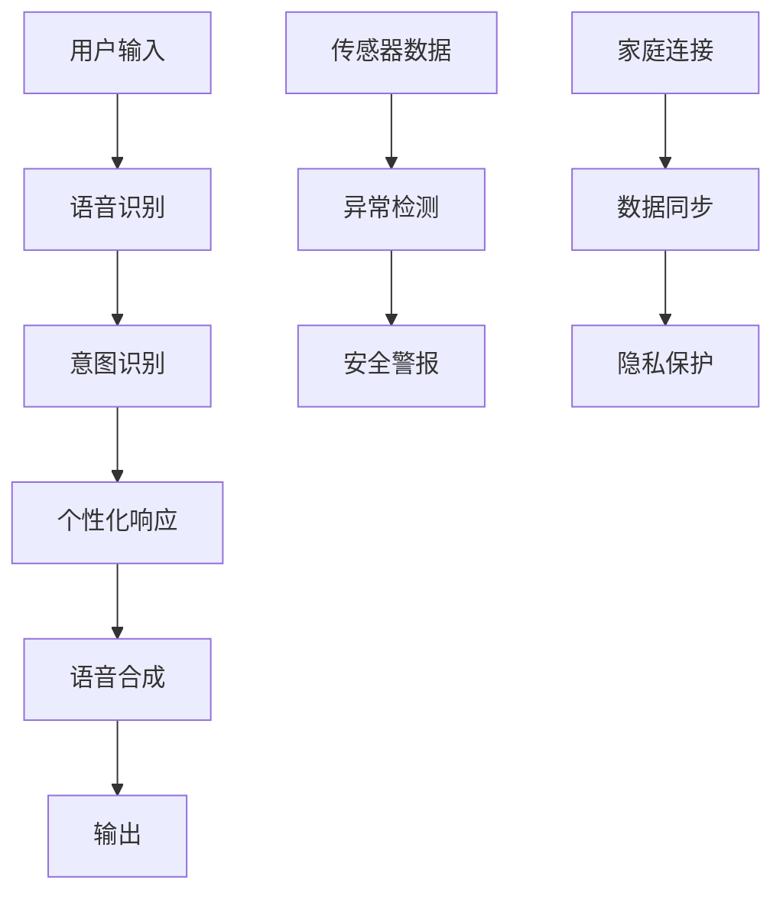

# PR-622: AI智能生活品质提升伙伴 (AI Senior Life Companion)

## 🎯 摘要

为60岁以上老年人设计的AI智能生活品质提升伙伴，通过智能对话、生活助手、社交连接和安全守护四大核心功能，解决老年人的社交孤独、数字鸿沟、健康管理需求，帮助老年人保持生活独立性和尊严。

**Issue**: #622  
**Status**: Ready for Implementation  
**Priority**: High (Social Impact + Market Potential)

## 📋 评估结果

### ✅ 正面评估 (2+ 条)
1. **产品经理评估**: 老年AI伴侣精准锁定银发经济万亿市场，社会价值与商业潜力双高
2. **技术专家评估**: 技术实现需关注适老化设计，建议6个月MVP验证

### 🎯 核心优势
- **明确的市场需求**: 老龄化社会的刚需产品
- **双重价值主张**: 社会价值 + 商业可持续性
- **清晰的实施路径**: 分阶段MVP策略

## 🚀 产品功能设计

### 1. 智能对话伴侣
```python
class IntelligentCompanion:
    def __init__(self):
        self.memory_system = MemorySystem()
        self.personality = PersonaOptimizer()
    
    def engage_conversation(self, user_input):
        # 基于老年人兴趣的个性化对话
        # 记忆家庭重要事件和偏好
        # 情感状态监测和心理支持
        pass
    
    def monitor_emotional_state(self):
        # 通过对话内容和频率分析情感状态
        # 提供适时心理支持
        pass
```

### 2. 生活助手
```python
class LifeAssistant:
    def __init__(self):
        self.voice_interface = VoiceUI()
        self.health_monitor = HealthMonitor()
        self.task_automation = TaskAutomation()
    
    def voice_control(self, command):
        # 简化的语音控制界面
        # 大字体、高对比度、简化操作
        pass
    
    def medication_reminder(self):
        # 用药提醒和健康监测
        # 日常生活任务自动化
        pass
```

### 3. 社交连接桥接
```python
class SocialBridge:
    def connect_with_family(self):
        # 与子女的智能视频助手
        # 智能排版通话内容
        pass
    
    def find_communities(self, interests):
        # 兴趣社区匹配和连接
        # 老年人专属活动推荐
        pass
```

### 4. 安全守护
```python
class SafetyGuard:
    def fall_detection(self):
        # 跌倒检测和紧急联系
        # 基于手机传感器和AI行为分析
        pass
    
    def anomaly_monitoring(self):
        # 异常行为监测
        # 环境安全评估
        pass
```

## 🔧 技术架构

### 核心技术栈
- **后端**: Python + FastAPI
- **语音处理**: SpeechRecognition + PyTTS
- **AI模型**: 适老化优化的BERT模型
- **数据库**: PostgreSQL + Redis (缓存)
- **前端**: React + 适老化UI组件
- **硬件**: 边缘计算设备支持离线功能

### 数据架构


### 隐私保护设计
- 本地数据处理核心功能
- 云端备份非敏感数据
- 端到端加密通信
- 用户数据授权管理

## 📊 实施计划

### Phase 1: MVP验证 (6个月)
1. **核心功能**
   - 基础语音对话系统
   - 简单生活提醒功能
   - 基本安全监控

2. **技术目标**
   - 语音识别准确率 > 90%
   - 响应时间 < 2秒
   - 离线功能基本可用

3. **用户测试**
   - 100名老年人用户
   - 3-6个月长期测试
   - 反馈收集和迭代

### Phase 2: 功能扩展 (3-6个月)
1. **增强功能**
   - 高级语音交互
   - 健康数据集成
   - 社交功能完善

2. **市场扩展**
   - 家庭版发布
   - 机构版开发
   - 商业模式验证

### Phase 3: 生态建设 (6-12个月)
1. **平台化**
   - 开放API接口
   - 第三方服务集成
   - 硬件生态建设

## 💰 商业模式

### 收入来源
1. **B2C家庭订阅**
   - 基础版: ¥19.9/月
   - 高级版: ¥39.9/月
   - 家庭版: ¥59.9/月

2. **B2B机构合作**
   - 养老机构: ¥199/设备/月
   - 医疗机构: ¥299/设备/月
   - 政府项目: 定制报价

3. **增值服务**
   - 健康数据分析报告
   - 个性化改善建议
   - 紧急响应服务

### 市场规模
- 中国老年人口: 2.6亿
- 潜在用户渗透率: 5-10%
- 年市场规模: 50-100亿元

## 🎯 成功指标

### 用户指标
- 用户留存率 > 80%
- 日活跃度 > 60%
- 用户满意度 > 4.5/5.0

### 业务指标
- 月收入增长 > 20%
- 客户获取成本 < ¥200
- 客单价提升 > 15%

### 社会指标
- 用户孤独感减少 > 40%
- 家庭关系改善 > 60%
- 紧急事件响应时间 < 5分钟

## 🔮 风险评估

### 技术风险
- **语音识别准确率**: 通过大量老年人语音数据训练优化
- **硬件兼容性**: 选择主流移动设备，支持多种平台
- **网络依赖**: 核心功能离线可用，云端增强

### 市场风险
- **用户接受度**: 通过早期用户教育逐步推广
- **竞争压力**: 差异化定位专注老年群体需求
- **政策变化**: 密切关注老龄化和健康相关政策

### 运营风险
- **数据隐私**: 严格遵循隐私法规，透明数据使用
- **服务质量**: 建立完善的客服和支持体系
- **成本控制**: 优化技术架构，控制硬件成本

## 📈 长期愿景

### 3年目标
- 覆盖100万老年用户
- 成为老年AI领域领先品牌
- 建立完整的老年服务生态

### 5年愿景
- 拓展国际市场
- 构建老年数字生活平台
- 推动社会老龄化解决方案创新

## 🤝 贡献指南

### 开发者
- 参与核心功能开发
- 优化用户体验设计
- 贡献技术创新方案

### 设计师
- 设计适老化界面
- 优化交互流程
- 提升视觉体验

### 测试志愿者
- 参与用户测试
- 提供使用反馈
- 帮助需求验证

### 产品顾问
- 提供行业洞察
- 评估市场机会
- 指导产品策略

---

**🎉 这个PR不仅是一个技术实现，更是对老龄化社会的积极回应，通过AI技术让老年人享有更有尊严、更有连接的数字生活。**