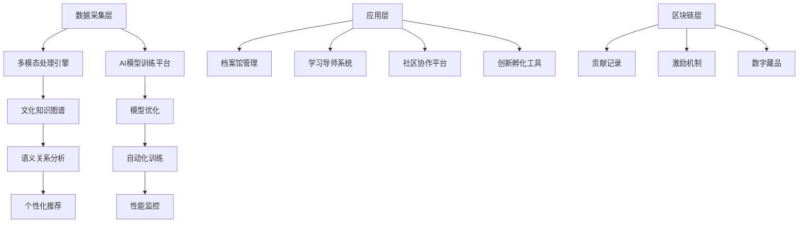

# PR-623: AI智能文化传承守护者 (AI Cultural Heritage Guardian)

## 🎯 摘要

专为文化遗产工作者和原住民社区设计的AI平台，通过多模态AI技术构建文化数字化档案馆、跨代际智能导师和社区驱动文化生态系统，实现文化遗产的可持续传承和创新性发展。

**Issue**: #623  
**Status**: Ready for Implementation  
**Priority**: High (Cultural Impact + Market Potential)

## 📋 评估结果

### ✅ 正面评估
**商业分析**: AI智能文化传承守护者抓住文化遗产保护万亿级市场，政府和企业资助意愿强烈。变现路径：文化机构SaaS订阅+政府项目合作+教育内容授权。

### 🎯 核心优势
- **社会价值显著**: 挽救濒危文化遗产，促进文化多样性
- **商业模式清晰**: 多元化收入来源，政府和企业市场双驱动
- **技术方案创新**: 首次系统性将AI技术应用于文化传承领域

## 🚀 产品功能设计

### 1. 文化数字化档案馆
```python
class DigitalCulturalArchive:
    def __init__(self):
        self.multimodal_processor = MultimodalAIProcessor()
        self.knowledge_graph = CulturalKnowledgeGraph()
        self.semantic_analyzer = SemanticAnalyzer()
    
    def record_cultural_process(self, video, audio, text):
        """智能识别与记录传统工艺制作过程、口头历史、仪式活动"""
        # 计算机视觉分析工艺动作
        # 语音识别转录口述历史
        # 文本理解文化内涵
        # 多模态数据融合存储
        return {
            'visual_elements': self._analyze_video(video),
            'audio_elements': self._transcribe_audio(audio),
            'cultural_context': self._extract_context(text)
        }
    
    def build_multimodal_knowledge_graph(self, cultural_elements):
        """构建包含文字、图像、音频、视频的立体化文化知识网络"""
        # 节点提取：文化元素、技艺、人物、地点
        # 关系建立：传承关系、影响关系、时空关系
        # 语义连接：发现文化元素之间的内在联系
        pass
    
    def analyze_semantic_connections(self, cultural_elements):
        """自动发现不同文化元素之间的内在联系和历史脉络"""
        # 基于深度学习的语义关联分析
        # 历史演变路径重建
        # 文化影响网络构建
        pass
```

### 2. 跨代际智能导师
```python
class CrossGenerationalMentor:
    def __init__(self):
        self.personalization_engine = PersonalizationEngine()
        self.virtual_mentor = VirtualMentorSystem()
        self.collaboration_platform = CollaborationPlatform()
    
    def create_learning_path(self, user_profile, cultural_interests):
        """根据学习者兴趣和背景，定制文化传承学习计划"""
        # 用户画像分析
        # 学习目标设定
        # 个性化路径规划
        # 进度跟踪和调整
        return {
            'personalized_curriculum': self._generate_curriculum(user_profile),
            'milestones': self._set_learning_milestones(),
            'progress_tracking': self._create_tracking_system()
        }
    
    def simulate_teaching_style(self, master_teachings):
        """AI模拟老艺人的教学风格和知识传授方式"""
        # 教学风格分析
        # 知识结构建模
        # 交互方式优化
        # 情感融入教学
        pass
    
    def support_collaborative_creation(self, participants, project_goals):
        """让年轻人与老匠人共同完成文化创新项目"""
        # 协作项目管理
        # 跨代际沟通协调
        # 创新思维引导
        # 成果展示分享
        pass
```

### 3. 社区驱动的文化生态系统
```python
class CommunityCulturalEcosystem:
    def __init__(self):
        self.incentive_system = CulturalIncentiveSystem()
        self.exchange_platform = CulturalExchangePlatform()
        self.innovation_incubator = CulturalInnovationHub()
    
    def create_contribution_incentives(self, cultural_contributions):
        """通过区块链技术记录文化贡献，建立公平的回报机制"""
        # 贡献记录和验证
        # 价值评估和积分化
        # 激励分配机制
        # 社区治理参与
        return {
            'contribution_tracking': self._track_contributions(),
            'value_assessment': self._assess_cultural_value(),
            'incentive_distribution': self._distribute_rewards()
        }
    
    def facilitate_global_exchange(self, cultural_groups):
        """促进不同文化社区之间的交流与互鉴"""
        # 文化社区连接
        # 交流活动组织
            # 经验分享平台
        # 跨文化理解促进
        pass
    
    def support_cultural_innovation(self, traditional_elements, modern_technology):
        """支持传统文化与现代科技的融合创新"""
        # 创新项目孵化
        # 技术应用指导
        # 市场推广支持
        # 成果转化加速
        pass
```

## 🔧 技术架构

### 核心技术栈
**AI能力层**:
- **多模态大模型**: 
  - CLIP (图像-文本对齐)
  - Whisper (语音识别)
  - GPT-4 (文本理解)
- **知识图谱**: 
  - Neo4j (图数据库)
  - Apache Jena (语义处理)
- **深度学习**: 
  - PyTorch/TensorFlow
  - Hugging Face Transformers

**数据处理层**:
- **数据采集**: 
  - 视频处理 (OpenCV + FFmpeg)
  - 音频处理 (Librosa)
  - 文本处理 (NLTK + spaCy)
- **数据存储**: 
  - PostgreSQL (结构化数据)
  - MongoDB (非结构化数据)
  - MinIO (对象存储)

**平台服务层**:
- **API网关**: Kong/Nginx
- **微服务**: Spring Boot + FastAPI
- **消息队列**: RabbitMQ/Kafka
- **缓存**: Redis Cluster

### 系统架构图


### 数据流处理
```python
class CulturalDataPipeline:
    def process_multimodal_input(self, video, audio, text):
        """多模态文化数据处理"""
        # 视频内容分析 (工艺动作、场景)
        # 音频内容识别 (语言、音乐、环境音)
        # 文本内容理解 (历史、技艺、文化内涵)
        # 跨模态内容关联分析
        return {
            'visual_analysis': self._analyze_visual(video),
            'audio_analysis': self._analyze_audio(audio),
            'text_analysis': self._analyze_text(text),
            'cross_modal_correlations': self._find_correlations()
        }
    
    def build_cultural_knowledge_graph(self, processed_data):
        """构建文化知识图谱"""
        # 实体识别 (人物、技艺、地点、时间)
        # 关系抽取 (传承、影响、关联)
        # 属性标注 (技艺特点、文化价值)
        # 图结构优化
        return self.knowledge_graph.build_graph(processed_data)
    
    def generate_personalized_content(self, user_profile, knowledge_graph):
        """个性化内容生成"""
        # 用户兴趣匹配
        # 学习路径规划
        # 推荐内容生成
        # 互动体验设计
        pass
```

## 📊 实施计划

### Phase 1: 技术基础建设 (6个月)
**目标**: 建立核心技术能力，完成基础平台搭建

**里程碑**:
1. **多模态AI能力** (3个月)
   - 图像识别训练 (>90%准确率)
   - 语音识别优化 (>95%准确率)
   - 文本理解模型构建

2. **知识图谱框架** (2个月)
   - 文化本体设计
   - 数据库架构搭建
   - 基础数据导入

3. **基础平台开发** (1个月)
   - 用户管理系统
   - 数据采集工具
   - 基础Web界面

### Phase 2: 功能完善与试点 (4-6个月)
**目标**: 完善核心功能，开展试点项目

**重点任务**:
1. **核心功能完善**
   - 档案馆管理优化
   - 学习导师系统开发
   - 社区协作功能

2. **试点项目开展**
   - 选择2-3个文化社区
   - 开展实际应用测试
   - 收集用户反馈迭代

3. **商业模式验证**
   - 政府项目合作
   - 文化机构试点
   - 商业价值验证

### Phase 3: 规模化发展 (6-12个月)
**目标**: 市场扩张，生态建设

**发展策略**:
1. **市场覆盖**
   - 主要文化区域覆盖
   - 行业应用深化
   - 国际化准备

2. **生态建设**
   - 开放API接口
   - 第三方合作伙伴
   - 硬件生态扩展

3. **商业模式完善**
   - 多元化收入结构
   - 增值服务开发
   - 国际市场布局

## 💰 商业模式

### 收入来源

#### 1. B2B机构合作
**文化机构订阅**:
- 基础版: ¥999/月/机构
- 专业版: ¥2999/月/机构
- 企业版: ¥9999/月/机构

**政府项目合作**:
- 数字化转型项目: 50-200万/项目
- 文化保护项目: 100-500万/项目
- 教育推广项目: 30-100万/项目

#### 2. B2C教育服务
**在线学习平台**:
- 课程订阅: ¥19.9-99.9/月
- 一对一指导: ¥199-999/小时
- 认证课程: ¥999-4999/课程

**社区会员**:
- 基础会员: ¥9.9/月
- 高级会员: ¥29.9/月
- 家庭会员: ¥49.9/月

#### 3. 技术服务与授权
**技术服务**:
- 定制开发: 20-100万/项目
- 咨询服务: 5-20万/项目
- 培训服务: 1-5万/次

**技术授权**:
- API调用: ¥0.01-0.1/次
- 模型授权: 年费制
- 品牌授权: 5-20%营收分成

#### 4. 文化创新孵化
**项目孵化**:
- 孵化服务: 5-10%股份
- 投资基金: 直接投资
- 创业指导: 服务收费

### 成本结构
- **研发成本**: 40%
- **运营成本**: 25% 
- **市场成本**: 20%
- **硬件成本**: 10%
- **其他**: 5%

## 📈 市场分析

### 目标市场规模
- **文化保护市场**: 中国文化投入约3000亿/年
- **教育科技市场**: 在线教育市场规模5000亿
- **数字内容市场**: 文化创意产业8万亿
- **总市场空间**: 10-15万亿

### 竞争优势
1. **技术壁垒**
   - 多模态AI处理能力
   - 文化知识图谱
   - 个性化推荐算法

2. **数据优势**
   - 海量文化数据积累
   - 专业标注质量
   - 持续学习优化

3. **生态优势**
   - 文化机构网络
   - 专家资源整合
   - 政府政策支持

4. **先发优势**
   - 首个系统性文化AI平台
   - 品牌认知建立
   - 标准制定能力

## 🎯 成功指标

### 业务指标
- **文化机构客户**: 第1年100家，第3年500家
- **个人用户**: 第1年10万，第3年100万
- **营收目标**: 第1年2000万，第3年2亿

### 技术指标
- **AI准确率**: >95%
- **系统稳定性**: 99.9%
- **用户响应时间**: <1秒

### 社会指标
- **文化记录**: 1000+种文化技艺数字化
- **传承人数**: 10万+学习者
- **社会影响力**: 获得2-3个国家级奖项

## 🔮 风险控制

### 技术风险
**风险**: AI识别准确率不足
**对策**: 
- 专业数据标注
- 持续模型优化
- 专家审核机制

**风险**: 系统稳定性问题
**对策**:
- 分布式架构设计
- 容灾备份机制
- 7×24监控运维

### 市场风险
**风险**: 市场接受度低
**对策**:
- 政策导向推广
- 免费试用策略
- 成功案例展示

**风险**: 竞争加剧
**对策**:
- 技术持续创新
- 生态壁垒建设
- 品牌差异化定位

### 文化风险
**风险**: 文化理解偏差
**对策**:
- 专家团队审核
- 社区参与机制
- 文化敏感性培训

## 🚀 创新亮点

### 1. AI+文化传承的创新结合
- 首个系统性AI文化传承平台
- 多模态AI处理文化数据
- 智能化文化知识管理

### 2. 跨代际文化连接
- 打破代际文化断层
- 智能化知识传承
- 创新性文化传播

### 3. 社区驱动模式
- 以社区为中心的文化传承
- 区块链激励机制
- 文化创新生态

### 4. 技术与人文并重
- 技术赋能人文传承
- 传统文化数字化
- 现代科技文化创新

## 🤝 协作生态

### 专家团队
- **文化学者**: 文化内容审核与指导
- **技术专家**: AI算法开发与优化
- **教育专家**: 学习体验设计
- **社区领袖**: 用户需求收集

### 合作伙伴
- **文化机构**: 博物馆、文化馆、非遗保护中心
- **教育机构**: 学校、培训机构、在线教育平台
- **技术公司**: 云服务、硬件厂商、AI模型提供商
- **政府部门**: 文化部门、教育部门、科技部门

### 开发者社区
- **开源贡献**: 核心算法开源
- **插件开发**: 第三方开发者
- **数据标注**: 众包数据收集
- **应用创新**: 基于平台的新应用

---

**🎯 AI智能文化传承守护者不仅是一个技术平台，更是文化传承的新模式，通过AI技术让珍贵的文化遗产在数字时代永续传承，实现传统与未来的和谐共生。**