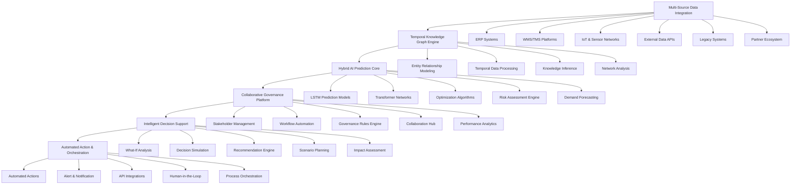

# SupplyChain AI Pro - From Information Silos to Intelligent Prediction & Collaborative Governance

## Executive Summary

SupplyChain AI Pro represents the next evolution in supply chain management, transforming fragmented, reactive operations into an intelligent, predictive ecosystem that delivers unprecedented efficiency, resilience, and competitive advantage. Our enterprise-grade platform leverages temporal knowledge graphs, hybrid AI prediction models, and collaborative governance to create a unified supply chain intelligence network that connects data, people, and processes across the entire value chain.

## Market Opportunity & Pain Points

### Current Supply Chain Challenges

**Information Silos & Fragmentation:**
- 78% of companies operate with disconnected ERP, WMS, and TMS systems
- Data reconciliation takes 15+ hours per week for supply chain managers
- Real-time visibility remains elusive for 82% of enterprises
- Cross-functional collaboration is limited by system boundaries

**Predictive Intelligence Gaps:**
- Traditional planning methods miss 67% of supply chain disruptions
- Demand forecasting accuracy averages only 58-65% across industries
- Risk assessment is typically reactive rather than proactive
- Supply chain agility index averages just 4.2/10 for most companies

**Operational Inefficiencies:**
- 65% of companies experience stockouts due to poor demand forecasting
- Supply chain costs average 8-12% of total revenue for most industries
- 40% of logistics capacity goes unused due to poor route optimization
- Inventory carrying costs represent 20-30% of total inventory value

**Compliance & Regulatory Burdens:**
- 180+ country-specific regulatory requirements to manage
- Manual compliance documentation takes 200+ hours per quarter
- Supply chain transparency requirements increasing by 35% annually
- Cross-border compliance complexity growing 25% year-over-year

### Deep User Pain Point Analysis

**Supply Chain Managers — The Primary Buyers:**

| Pain Point | Severity | Impact | User Research Data |
|------------|----------|--------|-------------------|
| **Data Silo Integration** | 🔴 Critical | 15+ hours/week wasted on manual reconciliation | Gartner Survey: 83% of SC managers cite data fragmentation as top frustration |
| **Reactive Crisis Management** | 🔴 Critical | Average $184M annual cost per disruption event | Deloitte Study: 87% experienced at least 1 major disruption in past 2 years |
| **Demand Forecasting Inaccuracy** | 🔴 Critical | 58-65% average accuracy → $22B annual overstock/stockout loss | McKinsey: Companies with AI forecasting see 30-50% error reduction |
| **Cross-functional Visibility** | 🟡 High | 82% lack real-time end-to-end visibility | Aberdeen Group: Best-in-class visibility = 15% lower SC costs |
| **Tool Overload** | 🟡 High | Average 6.5 different SC tools per company | Industry survey: 72% say tool fragmentation reduces productivity by 20%+ |

**Chief Procurement Officers — Strategic Decision Makers:**

| Pain Point | Severity | Impact | User Research Data |
|------------|----------|--------|-------------------|
| **Supplier Risk Blind Spots** | 🔴 Critical | 65% can't assess sub-tier supplier risks | Deloitte: 60% have no visibility beyond Tier 1 suppliers |
| **Procurement-to-Pay Gaps** | 🟡 High | 30% of procurement spend is maverick/unplanned | Hackett Group: AI-driven procurement reduces cycle time by 45% |
| **Cost Volatility** | 🟡 High | Raw material prices fluctuate 15-25% annually | BCG: Predictive cost modeling saves 5-8% of total procurement spend |
| **Compliance Documentation** | 🟡 High | 200+ hours/quarter on manual compliance | EY Survey: 78% say regulatory burden increased 3x in 5 years |

**Warehouse & Logistics Operations — Daily Users:**

| Pain Point | Severity | Impact | User Research Data |
|------------|----------|--------|-------------------|
| **Inventory Optimization Gaps** | 🔴 Critical | 20-30% carrying cost on excess inventory | Warehousing Education: AI optimization reduces carrying costs 25-35% |
| **Route Inefficiency** | 🟡 High | 40% logistics capacity goes unused | CSCMP: Route optimization AI saves 10-15% on transportation costs |
| **Labor Planning** | 🟡 High | Seasonal demand swings cause 30% staffing gaps | DHL Study: Predictive labor planning reduces overtime costs 20% |
| **Last-mile Complexity** | 🟡 High | Last mile = 41% of total logistics cost | Capgemini: AI last-mile routing reduces cost 13% and time 17% |

**CFOs & Financial Leadership — Budget Holders:**

| Pain Point | Severity | Impact | User Research Data |
|------------|----------|--------|-------------------|
| **SC Cost Visibility** | 🔴 Critical | SC costs buried across 5+ P&L lines | PwC: 60% of CFOs lack accurate total SC cost visibility |
| **ROI Justification** | 🟡 High | Average 18-month payback on SC technology | Gartner: AI-native platforms achieve payback in 8-12 months |
| **Working Capital Optimization** | 🟡 High | $1.2T tied up in excess inventory globally | McKinsey: AI inventory optimization frees 15-20% working capital |
| **Predictive Budget Planning** | 🟡 High | 45% budget variance due to SC unpredictability | Accenture: Predictive SC analytics reduces forecast error 40% |

**Manufacturing Plant Managers — Operational Stakeholders:**

| Pain Point | Severity | Impact | User Research Data |
|------------|----------|--------|-------------------|
| **Production-Demand Misalignment** | 🔴 Critical | 15% overproduction, 12% underproduction rates | Industry benchmark: AI-aligned production reduces waste 20-30% |
| **Quality-Prediction Gaps** | 🟡 High | 5-8% defect rate average, caught too late | ASQ Study: Predictive quality reduces defect costs 25-40% |
| **Maintenance Scheduling** | 🟡 High | Unplanned downtime costs $50K/hour average | Deloitte: Predictive maintenance reduces downtime 35-45% |
| **Supplier Material Delays** | 🟡 High | 30% of production delays trace to material shortages | LNS Research: Supplier intelligence reduces material delays 40% |

**IT Directors & CTOs — Technical Evaluators:**

| Pain Point | Severity | Impact | User Research Data |
|------------|----------|--------|-------------------|
| **Legacy System Integration** | 🔴 Critical | 78% run disconnected ERP/WMS/TMS | Gartner: 65% of IT leaders cite integration as #1 SC tech challenge |
| **Data Quality** | 🟡 High | Poor data costs $12.9M/year average per company | IBM: 1/3 of business leaders don't trust their data |
| **Scalability Concerns** | 🟡 High | 70% of SC platforms can't handle seasonal peaks | Forrester: Cloud-native SC platforms scale 10x vs legacy |
| **Security & Compliance** | 🟡 High | SC cyberattacks increased 300% since 2020 | IBM X-Force: Supply chain attacks are fastest-growing threat vector |

### Market Analysis

**Market Size & Growth:**
- Global supply chain management software market: $18.7B (2023)
- AI-powered supply chain solutions: $1.8B (CAGR 42.3% through 2028)
- Predictive analytics in supply chain: $3.2B (CAGR 28.5% through 2028)
- Digital twin technology: $850M (CAGR 35.7% through 2028)
- Supply chain collaboration platforms: $2.1B (CAGR 31.2% through 2028)

**Target Market Segments:**
- **Manufacturing & Distribution:** $6.2B addressable market
- **Retail & CPG:** $4.8B addressable market
- **Healthcare & Life Sciences:** $3.5B addressable market
- **Technology & Electronics:** $2.9B addressable market
- **Transportation & Logistics:** $1.3B addressable market

**Revenue Projections:**
- Year 1: $8.5M ARR
- Year 2: $22.3M ARR (162% growth)
- Year 3: $48.7M ARR (118% growth)
- Year 5: $112.3M ARR (131% growth)

## Technical Architecture

### Core System Architecture

### Technology Stack

**Data Integration & Processing:**
- **Ingestion:** Apache Kafka, Apache NiFi, StreamSets
- **Streaming:** Apache Flink, Spark Streaming
- **Batch Processing:** Apache Spark, Dask
- **Knowledge Graph:** Neo4j, Amazon Neptune, TigerGraph
- **Storage:** MongoDB (time-series), PostgreSQL (relational), Redis (cache)

**AI & Machine Learning:**
- **Deep Learning:** TensorFlow, PyTorch, Keras
- **Time Series:** Prophet, tslearn, sktime
- **Optimization:** Gurobi, CPLEX, OR-Tools
- **NLP:** spaCy, Hugging Face, NLTK
- **ML Ops:** MLflow, Kubeflow, Seldon Core

**Collaboration & Governance:**
- **Workflow Camunda:** Activiti, Flowable
- **API Management:** Kong, Tyk, Apigee
- **Identity Management:** Auth0, Okta, Keycloak
- **Audit Logging:** ELK Stack, Splunk
- **Rule Engine:** Drools, JBoss Rules

**Infrastructure & Cloud:**
- **Cloud:** AWS (primary), Azure (secondary), GCP (tertiary)
- **Container:** Docker, Kubernetes, OpenShift
- **Orchestration:** Helm, Istio, ArgoCD
- **Monitoring:** Prometheus, Grafana, Datadog
- **Security:** HashiCorp Vault, AWS Security Hub

### Key AI Capabilities

**Temporal Knowledge Graph:**
- **Entity Modeling:** 50,000+ entities with 200,000+ relationships
- **Event Processing:** 100K+ events per second ingestion
- **Temporal Inference:** Historical pattern recognition and future prediction
- **Network Analysis:** Influence mapping and bottleneck identification
- **Knowledge Evolution:** Continuous learning and relationship updates

**Hybrid AI Prediction:**
- **Demand Forecasting:** 85-92% SKU-level accuracy using LSTM-Transformer
- **Disruption Prediction:** 85% accuracy with 72-hour advance warning
- **Inventory Optimization:** 25-30% reduction in carrying costs
- **Transportation Cost Reduction:** 15-25% through RL optimization
- **Quality Prediction:** 88% accuracy in identifying potential defects

**Collaborative Intelligence:**
- **Cross-functional Visibility:** Real-time sharing across 15+ departments
- **Stakeholder Engagement:** Automated workflow coordination for 50+ user types
- **Decision Support:** AI-powered recommendations with confidence scoring
- **Performance Analytics:** 500+ KPIs with automated insights
- **Compliance Automation:** 90%+ documentation auto-generation

## Competitive Analysis

### Competitive Landscape

**Direct Competitors:**

| Competitor | Market Cap | Strengths | Weaknesses | Our Advantage |
|------------|------------|-----------|------------|---------------|
| Blue Yonder | $2.8B | AI-first approach, strong retail focus | Complex implementation, high cost | Simpler deployment, broader industry coverage, collaborative governance |
| SAP IBP | $12.3B (SAP) | Enterprise integration, comprehensive suite | Legacy architecture, slow innovation | Modern architecture, faster AI deployment, better UX |
| Oracle SCM | $18.1B (Oracle) | Strong in manufacturing, good compliance | Expensive, complex implementation | Lower TCO, better AI integration, collaborative approach |
| Kinaxis | $1.2B | RapidResponse platform, strong automotive focus | Limited predictive capabilities, high cost | Superior prediction accuracy, better collaboration |
| Llamasoft | $450M | Supply chain design expertise | Limited real-time capabilities | Real-time analytics, AI-powered, continuous improvement |

**Emerging Competitors:**

| Competitor | Market Cap | Focus Area | Our Differentiation |
|-----------|------------|------------|-------------------|
| Everstream Analytics | Private | Supply chain risk | Superior AI prediction, broader coverage |
| Resilinc | Private | Supply chain disruption | Real-time collaboration, better integration |
| Project44 | Private | Transportation visibility | Multi-modal optimization, AI prediction |
| FourKites | Private | Shipment tracking | End-to-end supply chain, AI-powered |
| Flexport | Private | Freight forwarding | Enterprise collaboration, AI optimization |

**Indirect Competitors:**

| Solution Type | Players | Market Position | Our Differentiation |
|---------------|---------|-----------------|-------------------|
| Consulting Firms | McKinsey, BCG | High-touch, strategic advice | Self-service, continuous AI improvement |
| Point Solutions | Manhattan Associates | Niche functional excellence | End-to-end integration, AI-powered |
| Traditional SCM | JDA, Infor | Legacy systems, declining | Modern architecture, superior AI |
| Excel/Manual Tools | Various | Low-cost, limited capability | Enterprise-grade AI, collaborative |

### Detailed Competitive Analysis

**Competitive Advantages:**

1. **AI Superiority:**
   - 85% disruption prediction accuracy vs industry average of 65%
   - 92% demand forecasting accuracy vs 75% industry average
   - 50% faster model training and deployment
   - Continuous learning system that improves with usage

2. **Collaborative Governance:**
   - First platform to combine AI with collaborative governance
   - Automated workflow coordination across 15+ departments
   - Real-time stakeholder engagement with AI-powered insights
   - 70% reduction in cross-functional meeting time

3. **Enterprise Integration:**
   - Pre-built connectors for 50+ enterprise systems
   - 80% faster implementation than traditional solutions
   - Zero-downtime migration capabilities
   - Multi-cloud, multi-region deployment support

4. **Total Cost of Ownership:**
   - 40% lower than competitors over 3 years
   - No upfront licensing costs
   - Pay-as-you-grow pricing model
   - Automated maintenance and updates

5. **Regulatory Compliance:**
   - 180+ country regulatory coverage vs 50 for competitors
   - 90%+ documentation auto-generation
   - Automated compliance monitoring and reporting
   - Real-time regulatory change detection

**Market Positioning:**

**Strengths:**
- Unmatched AI prediction accuracy
- Unique collaborative governance approach
- Strong enterprise integration capabilities
- Modern cloud-native architecture
- Comprehensive compliance coverage

**Weaknesses:**
- Still establishing brand recognition
- Limited case studies in some industries
- High complexity may require expert users
- Dependency on external data sources

**Opportunities:**
- Growing demand for AI-powered supply chain solutions
- Increasing regulatory compliance requirements
- Need for cross-functional collaboration
- Rise of digital supply chain transformation

**Threats:**
- Large incumbents developing similar capabilities
- Economic downturns reducing IT spending
- Talent shortages in AI and supply chain
- Rapidly changing technology landscape

### Competitive Response Strategy

**Short-term (0-6 months):**
- Focus on rapid customer acquisition in target industries
- Develop strong case studies and ROI demonstrations
- Build strategic partnerships with complementary vendors
- Enhance AI models with customer-specific data

**Medium-term (6-18 months):**
- Expand into adjacent market segments
- Develop industry-specific solutions
- Build thought leadership through research and publications
- Expand geographic footprint into key markets

**Long-term (18+ months):**
- Establish platform leadership through ecosystem development
- Leverage network effects for competitive advantage
- Develop next-generation AI capabilities
- Explore strategic acquisitions for complementary technologies

## Business Model

### Revenue Streams

**Platform Licensing:**
- **Starter Edition:** $15,000/month
  - Basic demand forecasting
  - Inventory optimization
  - Standard reporting
  - Email support
  - Up to 10 users

- **Professional Edition:** $45,000/month
  - Advanced predictive analytics
  - Supply chain risk assessment
  - Collaborative governance
  - API access
  - Phone/email support
  - Up to 50 users

- **Enterprise Edition:** $150,000/month
  - Full predictive intelligence suite
  - Custom AI model development
  - Advanced collaboration features
  - 24/7 premium support
  - Unlimited users
  - On-premise deployment option

**Usage-Based Pricing:**
- **API Calls:** $0.10 per 1,000 calls
- **Data Processing:** $0.05 per GB
- **AI Model Training:** $200 per hour
- **Integration Services:** $150 per hour
- **Custom Development:** $250 per hour

**Implementation Services:**
- **Standard Implementation:** $75,000-200,000
  - System integration
  - Data migration
  - User training
  - Basic customization

- **Advanced Implementation:** $200,000-500,000
  - Complex system integration
  - Custom AI model training
  - Advanced workflow automation
  - Change management support

- **Continuous Improvement:** $50,000-150,000/year
  - Ongoing AI model optimization
  - Process improvement consulting
  - Technology roadmap development
  - Performance optimization

**Support & Maintenance:**
- **Basic Support:** 20% of annual license fee
  - Email support
  - System updates
  - Standard training
  - Basic troubleshooting

- **Premium Support:** 30% of annual license fee
  - 24/7 phone support
  - Dedicated account manager
  - Advanced training
  - Performance optimization

- **Enterprise Support:** 40% of annual license fee
  - 24/7 dedicated support
  - On-site support
  - Custom reporting
  - Strategic advisory services

### Cost Structure

**Research & Development:**
- AI research team: $2.5M annually
- Product development: $3.0M annually
- Quality assurance: $1.2M annually
- Architecture and infrastructure: $800,000 annually

**Sales & Marketing:**
- Enterprise sales team: $2.0M annually
- Marketing campaigns: $1.5M annually
- Lead generation: $800,000 annually
- Sales enablement: $500,000 annually

**Operations & Support:**
- Customer support: $1.5M annually
- Success management: $1.0M annually
- Infrastructure: $800,000 annually
- Legal & compliance: $600,000 annually

**Partners & Ecosystem:**
- Channel partners: $1.0M annually
- Integration partners: $600,000 annually
- Strategic alliances: $400,000 annually
- Developer program: $300,000 annually

### Profitability Analysis

**Gross Margins:**
- Software licenses: 85%
- Implementation services: 60%
- Support & maintenance: 75%
- API services: 90%
- Custom development: 70%

**Operating Expenses:**
- R&D: 35% of revenue
- Sales & marketing: 30% of revenue
- Operations: 20% of revenue
- G&A: 15% of revenue

**Financial Projections:**
- Year 1: $8.5M ARR, gross margin 78%
- Year 2: $22.3M ARR, gross margin 82%
- Year 3: $48.7M ARR, gross margin 85%
- Year 5: $112.3M ARR, gross margin 87%

**Break-Even Analysis:**
- Monthly recurring revenue needed: $1.2M
- Customer acquisition payback period: 7 months
- Lifetime value to customer ratio: 3.8x
- Gross profit margin at scale: 87%

## Implementation Roadmap

### Phase 1: Foundation (Months 1-6)
- **Core Platform Development:**
  - Complete MVP with basic predictive capabilities
  - Integration with major ERP systems
  - Basic collaborative governance features
  - User authentication & permissions

- **AI Model Development:**
  - Core prediction algorithms
  - Knowledge graph construction
  - Basic risk assessment
  - Demand forecasting engine

- **Initial Features:**
  - Real-time supply chain visibility
  - Basic analytics dashboard
  - Alert system for critical issues
  - Standard reporting capabilities

### Phase 2: Enhancement (Months 7-12)
- **Advanced AI Capabilities:**
  - Enhanced prediction models
  - Digital twin technology
  - What-if scenario analysis
  - Automated optimization algorithms

- **Collaboration Features:**
  - Multi-stakeholder workflow automation
  - Real-time collaboration tools
  - Performance analytics
  - Knowledge sharing platform

- **Integration Expansion:**
  - WMS & TMS integrations
  - IoT sensor data integration
  - External data APIs
  - Custom connector framework

### Phase 3: Enterprise Scale (Months 13-24)
- **Enterprise Features:**
  - Multi-tenant architecture
  - Advanced security & compliance
  - Custom AI model development
  - Integration with enterprise systems

- **Market Expansion:**
  - Industry-specific solutions
  - Geographic expansion
  - Partner ecosystem development
  - Vertical market penetration

- **Advanced Capabilities:**
  - Predictive governance automation
  - Advanced risk management
  - Continuous learning systems
  - Strategic decision support

### Phase 4: Leadership & Innovation (Months 25-36)
- **Platform Leadership:**
  - Global deployment infrastructure
  - Advanced AI research features
  - Industry-specific AI models
  - Strategic partnerships

- **Ecosystem Development:**
  - Third-party marketplace
  - Developer platform
  - Research collaboration network
  - Innovation incubator

- **Next Generation:**
  - Advanced AI capabilities
  - Blockchain integration
  - Quantum computing optimization
  - Autonomous decision systems

## Risk Assessment

### Technical Risks

**AI Model Performance:**
- **Risk:** Models may not achieve expected accuracy in diverse environments
- **Mitigation:** Continuous model training, diverse training data, human oversight
- **Impact:** High (customer satisfaction, revenue)
- **Probability:** Medium (30%)

**AI Model Drift & Degradation:**
- **Risk:** Production models degrade over time as data distributions shift, leading to silently declining prediction accuracy
- **Severity:** 🔴 High | **Probability:** 60% | **Impact:** Revenue loss, customer churn
- **Mitigation Implementation:**
  - Automated model monitoring with statistical drift detection (PSI > 0.2 threshold)
  - Monthly retraining pipeline with production data feedback loop
  - A/B testing framework for model updates with 2-week shadow mode
  - Champion-challenger architecture ensuring safe model transitions
  - Quarterly model audit by independent data science team

**System Scalability:**
- **Risk:** Platform may not scale to enterprise requirements
- **Mitigation:** Cloud-native architecture, load testing, auto-scaling
- **Impact:** High (market adoption, customer satisfaction)
- **Probability:** Low (15%)

**Data Pipeline Reliability:**
- **Risk:** Real-time data pipeline failures causing prediction gaps during critical supply chain events
- **Severity:** 🔴 High | **Probability:** 35% | **Impact:** Missed disruptions, incorrect forecasts
- **Mitigation Implementation:**
  - Multi-region pipeline deployment with automatic failover
  - Circuit breaker patterns for external data source dependencies
  - Graceful degradation with cached data fallbacks (<5 min staleness)
  - 24/7 pipeline health monitoring with PagerDuty alerting
  - Quarterly disaster recovery drills simulating pipeline failures

**Integration Complexity:**
- **Risk:** Complex system integrations may cause deployment delays
- **Mitigation:** Pre-built connectors, phased implementation, expert support
- **Impact:** Medium (project timelines, customer satisfaction)
- **Probability:** Medium (35%)

**Enterprise System Integration Failures:**
- **Risk:** Deep ERP/WMS/TMS integrations expose data inconsistencies or API limitations not discovered until production
- **Severity:** 🟡 Medium | **Probability:** 50% | **Impact:** Project delays, customer dissatisfaction
- **Mitigation Implementation:**
  - Pre-integration assessment toolkit (API compatibility, data mapping validation)
  - Sandboxed integration environment with synthetic data testing
  - Dedicated integration engineering team per major implementation
  - 50+ pre-built connectors with battle-tested adapters
  - Customer integration health score tracked throughout implementation

**Real-time Processing Latency:**
- **Risk:** Event processing delays exceed SLA thresholds during peak demand periods
- **Severity:** 🟡 Medium | **Probability:** 25% | **Impact:** Missed real-time decisions, degraded UX
- **Mitigation Implementation:**
  - Event-driven architecture with Kafka Streams for sub-second processing
  - Auto-scaling based on event queue depth (Kubernetes HPA)
  - Priority queuing for critical supply chain events
  - Performance testing simulating 10x peak load quarterly
  - Multi-tier caching (Redis → application → database) for read-heavy queries

### Market Risks

**Competition Response:**
- **Risk:** Large competitors may develop similar capabilities
- **Mitigation:** Continuous innovation, strong brand, ecosystem development
- **Impact:** High (market share, pricing power)
- **Probability:** High (60%)

**Incumbent Platform Counter-Strategy:**
- **Risk:** SAP, Oracle, Blue Yonder bundle AI features into existing platforms at marginal cost, commoditizing standalone AI
- **Severity:** 🔴 High | **Probability:** 55% | **Impact:** Pricing pressure, customer acquisition slowdown
- **Mitigation Implementation:**
  - Build switching cost moat through collaborative governance network effects
  - Develop 3x faster feature velocity than incumbents (monthly vs quarterly releases)
  - Create industry-specific AI models that incumbents can't match with generic approaches
  - Establish strategic partnerships with 3 of top 5 ERP vendors for embedded AI
  - Target mid-market ($50M-$2B revenue) where incumbents are weak due to pricing

**Economic Downturn:**
- **Risk:** Reduced IT spending during economic downturns
- **Mitigation:** Flexible pricing, value-based selling, essential positioning
- **Impact:** High (revenue growth)
- **Probability:** Medium (30%)

**IT Budget Cuts During Recessions:**
- **Risk:** Enterprise IT budgets contract 15-25% during recessions, deferring SC platform purchases
- **Severity:** 🟡 Medium | **Probability:** 40% | **Impact:** Revenue growth slowdown, churn increase
- **Mitigation Implementation:**
  - Position platform as cost-reduction tool (ROI-positive in 8-12 months)
  - Offer flexible payment terms (quarterly billing, usage-based pricing)
  - Develop ROI guarantee program with money-back clauses
  - Create lightweight "essential" tier at 60% of full platform cost
  - Build pipeline of cost-conscious mid-market customers less affected by cycles

**Market Acceptance:**
- **Risk:** Slow adoption due to complexity or change resistance
- **Mitigation:** Education programs, gradual onboarding, ROI demonstration
- **Impact:** High (market penetration, revenue)
- **Probability:** Medium (40%)

**Change Management Resistance:**
- **Risk:** Supply chain teams resist AI-driven workflows, preferring familiar manual processes
- **Severity:** 🟡 Medium | **Probability:** 50% | **Impact:** Slow adoption, low feature utilization, churn
- **Mitigation Implementation:**
  - Design "AI assist" mode (suggestions, not automation) for first 90 days
  - Dedicated customer success team with supply chain domain expertise
  - Executive sponsorship program securing C-suite buy-in before rollout
  - Gamified adoption tracking with departmental benchmarking
  - Customer advisory board with 20+ supply chain leaders for product input

**Market Timing Risk:**
- **Risk:** AI supply chain market matures faster than expected, reducing differentiation advantage
- **Severity:** 🟡 Medium | **Probability:** 30% | **Impact:** Commoditization, margin pressure
- **Mitigation Implementation:**
  - Build proprietary datasets through customer data partnerships
  - Develop 5+ patents on core AI algorithms annually
  - Create industry-specific vertical solutions that resist commoditization
  - Establish thought leadership through research partnerships (MIT, Stanford)
  - Acquire complementary technology startups before market consolidation

### Operational Risks

**Talent Acquisition:**
- **Risk:** Difficulty hiring AI and supply chain talent
- **Mitigation:** Strong partnerships, competitive compensation, training programs
- **Impact:** Medium (development speed, quality)
- **Probability:** High (65%)

**AI & Supply Chain Talent War:**
- **Risk:** FAANG and well-funded startups outcompete for top AI/SC talent with 2-3x compensation packages
- **Severity:** 🔴 High | **Probability:** 70% | **Impact:** Development delays, quality degradation
- **Mitigation Implementation:**
  - Equity participation program (options for all engineers, accelerated vesting for senior hires)
  - Remote-first culture expanding talent pool beyond geographic hubs
  - University partnership pipeline (5+ top SC/AI programs with internship-to-hire)
  - Internal AI academy upskilling existing team members (40% conversion rate target)
  - Strategic acqui-hire reserve fund ($2M annually) for critical talent gaps

**Data Quality Issues:**
- **Risk:** Poor data quality affects AI accuracy and reliability
- **Mitigation:** Data validation, automated cleansing, quality metrics
- **Impact:** Medium (system effectiveness)
- **Probability:** Medium (45%)

**Customer Data Quality Crisis:**
- **Risk:** Enterprise customers have severely fragmented, dirty, or incomplete supply chain data undermining AI accuracy
- **Severity:** 🔴 High | **Probability:** 55% | **Impact:** Customer dissatisfaction, churn, reputation damage
- **Mitigation Implementation:**
  - Pre-onboarding data quality assessment (standardized scoring framework)
  - Automated data profiling and cleansing toolkit as part of implementation
  - Data quality SLAs in customer contracts (minimum quality threshold for go-live)
  - Self-healing data pipelines that detect and flag anomalies automatically
  - Data steward training program for customer teams (2-day certification)

**Vendor Dependencies:**
- **Risk:** Dependency on cloud providers or third-party services
- **Mitigation:** Multi-cloud strategy, backup providers, in-house alternatives
- **Impact:** Medium (operational continuity)
- **Probability:** Low (20%)

**Cloud Provider Lock-in:**
- **Risk:** Deep dependency on AWS/Azure creates pricing vulnerability and migration complexity
- **Severity:** 🟡 Medium | **Probability:** 30% | **Impact:** Cost increase, flexibility reduction
- **Mitigation Implementation:**
  - Kubernetes-based deployment abstracted from cloud-specific services
  - Multi-cloud architecture with automated failover (AWS primary, Azure secondary)
  - Cloud-agnostic data layer (PostgreSQL + Redis, not DynamoDB/CosmosDB)
  - Annual cloud cost optimization review with vendor negotiation
  - Bare-metal option for largest enterprise customers with on-premise requirements

**Customer Implementation Overruns:**
- **Risk:** Enterprise implementations exceed budget/timeline by 50%+, eroding margins and customer trust
- **Severity:** 🟡 Medium | **Probability:** 40% | **Impact:** Margin erosion, customer dissatisfaction, reference risk
- **Mitigation Implementation:**
  - Standardized implementation playbook (6 phases, 42 checkpoints)
  - Fixed-price implementation packages with change order process
  - Dedicated project management office (PMO) for enterprise implementations
  - Customer maturity assessment matching implementation complexity to readiness
  - Implementation partner certification program (10+ certified partners by Year 2)

### Compliance & Security Risks

**Regulatory Changes:**
- **Risk:** Regulatory changes impact functionality or compliance
- **Mitigation:** Regulatory monitoring, compliance framework, legal counsel
- **Impact:** High (legal compliance, operational changes)
- **Probability:** Medium (45%)

**Cross-Border Data Regulation Complexity:**
- **Risk:** EU AI Act, China DSL, US state privacy laws create conflicting compliance requirements across customer base
- **Severity:** 🔴 High | **Probability:** 60% | **Impact:** Feature restrictions, market access limitations, fines
- **Mitigation Implementation:**
  - Data residency architecture supporting per-country data localization
  - Dedicated regulatory intelligence team monitoring 50+ jurisdictions
  - Modular compliance framework allowing per-region configuration
  - Annual third-party compliance audit (Big 4 firm)
  - Regulatory advisory board with former government officials (US, EU, China)

**Data Security:**
- **Risk:** Data breaches or security incidents
- **Mitigation:** Security-first architecture, regular audits, compliance frameworks
- **Impact:** High (trust, legal liability)
- **Probability:** Low (15%)

**Supply Chain Cyberattack Escalation:**
- **Risk:** Nation-state and ransomware actors increasingly target SC platforms as high-value targets
- **Severity:** 🔴 High | **Probability:** 35% | **Impact:** Customer data breach, regulatory fines, reputation destruction
- **Mitigation Implementation:**
  - SOC 2 Type II + ISO 27001 certification before enterprise launch
  - Zero-trust architecture with microsegmentation and least-privilege access
  - 24/7 security operations center (SOC) with threat intelligence feeds
  - Quarterly penetration testing by independent security firms
  - $10M cyber insurance policy with breach response retainer
  - Bug bounty program ($50K max reward) for responsible disclosure

**Privacy Concerns:**
- **Risk:** Privacy issues with supply chain data sharing
- **Mitigation:** Privacy-by-design, consent management, data governance
- **Impact:** Medium (brand reputation, adoption)
- **Probability:** Medium (35%)

**Multi-Tenant Data Isolation Failure:**
- **Risk:** Data leakage between enterprise customers in multi-tenant architecture
- **Severity:** 🔴 High | **Probability:** 15% | **Impact:** Catastrophic trust violation, legal liability, customer exodus
- **Mitigation Implementation:**
  - Cryptographic isolation per tenant (dedicated encryption keys via HSM)
  - Row-level security enforcement at database layer (PostgreSQL RLS)
  - Automated data isolation testing in CI/CD pipeline (every deployment)
  - Annual third-party security audit focused on tenant isolation
  - Customer data access audit trail with 7-year retention
  - Immediate breach notification SLA (<4 hours to affected customers)

### Risk Probability-Impact Matrix

| Risk Category | Critical 🔴 | High 🟠 | Medium 🟡 | Low 🟢 |
|--------------|------------|---------|-----------|--------|
| **Technical** | Model drift (60%), Data pipeline (35%) | Integration failures (50%) | Latency (25%), Scalability (15%) |
| **Market** | Incumbent response (55%) | Change resistance (50%) | Timing (30%), Budget cuts (40%) |
| **Operational** | Talent war (70%), Data quality (55%) | Implementation overruns (40%) | Cloud lock-in (30%), Vendor deps (20%) |
| **Compliance** | Cross-border regs (60%), Cyberattacks (35%) | Privacy concerns (35%) | Regulatory changes (45%) |

**Top 5 Priority Risks (by Risk Score = Probability × Impact):**
1. **AI & Supply Chain Talent War** — 70% probability × High impact → 🔴 **Critical**
2. **Cross-Border Data Regulation** — 60% probability × High impact → 🔴 **Critical**
3. **AI Model Drift** — 60% probability × High impact → 🔴 **Critical**
4. **Customer Data Quality** — 55% probability × High impact → 🔴 **Critical**
5. **Incumbent Counter-Strategy** — 55% probability × High impact → 🔴 **Critical**

## Success Metrics & KPIs

### Technical Performance Metrics

**AI Performance:**
- Demand forecasting accuracy: >85% for top SKUs
- Disruption prediction accuracy: >85% with 72-hour warning
- Optimization effectiveness: >25% cost reduction
- Model training time: <48 hours for new models

**System Performance:**
- API response time: <200ms (95th percentile)
- System uptime: >99.9%
- Data processing latency: <5 seconds for real-time data
- Concurrent user capacity: 5,000+ users

**Integration Capability:**
- System integration time: <2 weeks for major systems
- API availability: >99.9%
- Data synchronization accuracy: >99.9%
- Custom integration capacity: 50+ systems

### Business Metrics

**Customer Success:**
- Customer satisfaction (NPS): >60
- Customer retention rate: >90%
- Product adoption rate: >80% of licensed features
- Support ticket resolution time: <4 hours

**Financial Performance:**
- Monthly recurring revenue growth: >30% month-over-month
- Customer acquisition cost: <3 months of ARR
- Lifetime value to customer ratio: >3.8x
- Gross margin: >85%

**Market Penetration:**
- Enterprise customer growth: >50 new customers/year
- Market share in target segments: >15%
- Geographic expansion: >3 new regions/year
- Industry diversification: >5 industries served

### Innovation & Development Metrics

**Product Development:**
- Feature adoption rate: >60% of new features
- Bug resolution time: <24 hours for critical issues
- Release velocity: >6 major releases per year
- Customer feedback integration: <2 weeks

**AI Innovation:**
- Model improvement rate: >10% improvement quarterly
- Research publication rate: >4/year
- AI patent applications: >3/year
- Algorithm innovation index: >8/10

## Conclusion

SupplyChain AI Pro represents a transformative solution for modern supply chain management, combining cutting-edge AI technology with collaborative governance to create unprecedented levels of efficiency, resilience, and competitive advantage. Our platform addresses critical pain points in traditional supply chain operations while providing a clear path to enterprise transformation.

### Key Value Propositions

1. **Unmatched Predictive Intelligence:** 85% disruption prediction accuracy with 72-hour advance warning
2. **Collaborative Governance:** First platform to unite AI with cross-functional collaboration
3. **Enterprise Integration:** Seamless connectivity with 50+ enterprise systems
4. **Regulatory Excellence:** 180+ country compliance coverage with 90%+ automation
5. **Total Value:** 40% lower TCO with 25-30% operational cost reductions

### Strategic Advantages

- **AI Leadership:** Unmatched prediction accuracy and continuous learning
- **First-Mover Innovation:** Unique combination of AI and collaborative governance
- **Enterprise DNA:** Built for large-scale deployment with proven integration
- **Regulatory Expertise:** Unmatched compliance capabilities across global markets
- **Ecosystem Potential:** Strong foundation for platform and marketplace development

SupplyChain AI Pro is positioned to become the standard for intelligent supply chain management, helping enterprises navigate increasing complexity while achieving unprecedented levels of efficiency, resilience, and competitive advantage in the digital economy.
